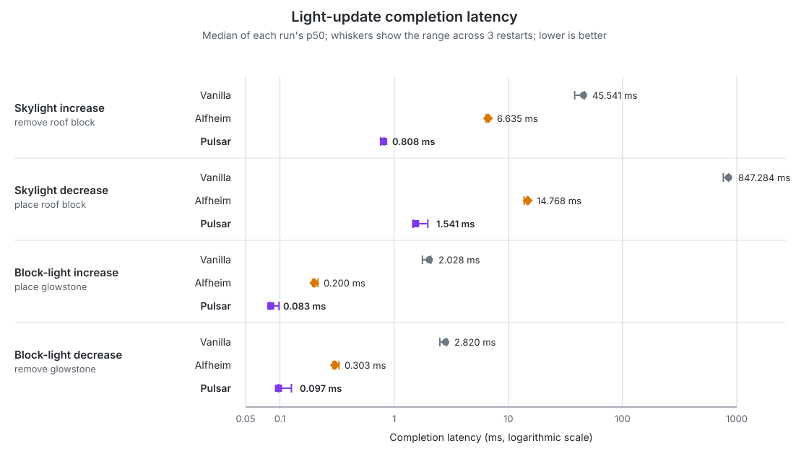
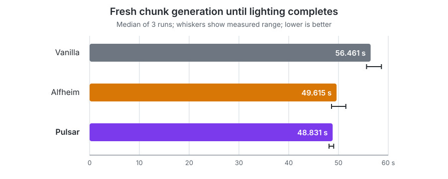

# Pulsar

Pulsar is an async lighting engine for [CleanroomLoader](https://github.com/CleanroomMC/Cleanroom). It reimplements
Starlight-style lighting algorithms for 1.12.2 and moves most server-side
block-light and sky-light propagation off the main server thread.

Unlike vanilla and Alfheim, Pulsar performs most propagation work on dedicated
worker threads. Its goal is to provide an actively developed Cleanroom-native
alternative to lighting engines such as Alfheim and Phosphor.

## Requirements

- [Cleanroom 0.6.10-alpha or newer](https://github.com/CleanroomMC/Cleanroom/releases/tag/0.6.10-alpha)

## Features

Pulsar is designed to reduce server-thread stalls when lighting has a large
amount of work to resolve, such as during chunk generation, explosions,
large building-tool operations, or machine-driven block changes.

- Runs server-side block-light and sky-light propagation on dedicated worker
  threads.
- Batches large groups of block changes instead of lighting every edit
  separately.
- Stores completed Pulsar light data in each chunk's NBT, avoiding unnecessary
  full relights when valid cached chunks are loaded again.
- Keeps Minecraft's standard block-light and sky-light data synchronized, so
  the additional Pulsar cache can be discarded safely if Pulsar is removed.
- Fixes vanilla propagation and rendering problems involving stairs, slabs,
  liquids, emissive blocks, paintings, empty sections, and chunk borders.

The largest gains appear under heavy lighting load. At lighter loads, Pulsar's
main benefit is lower light-update latency rather than higher TPS.

## Fixed Vanilla Issues

Pulsar includes fixes for the following vanilla lighting and rendering issues:

- [MC-92](https://bugs.mojang.com/browse/MC-92)
- [MC-1531](https://bugs.mojang.com/browse/MC-1531) — smooth lighting across
  painting tile boundaries. Only paintings are covered; item frames are not.
- [MC-3329](https://bugs.mojang.com/browse/MC-3329)
- [MC-80966](https://bugs.mojang.com/browse/MC-80966)
- [MC-104532](https://bugs.mojang.com/browse/MC-104532)
- [MC-116690](https://bugs.mojang.com/browse/MC-116690)
- [MC-117067](https://bugs.mojang.com/browse/MC-117067)
- [MC-117094](https://bugs.mojang.com/browse/MC-117094)
- [MC-249343](https://bugs.mojang.com/browse/MC-249343)

## Compatibility

Pulsar should work with most biome, cave, world-generation, and dimension mods
that use Minecraft's standard chunk and world APIs. Please report combinations
that do not work as expected.

### Supported integrations

- [Celeritas](https://git.taumc.org/embeddedt/celeritas), including face-aware
  lighting for stairs and slabs.
- [Fluidlogged API](https://modrinth.com/mod/fluidlogged-api), including the
  opacity and emission of fluids stored inside fluidlogged blocks.
- [Depths Update](https://modrinth.com/mod/depths-update), including dimensions
  that extend below Y=0 or above Y=255.
- [JSON Paintings](https://www.curseforge.com/minecraft/mc-mods/json-paintings),

### Incompatible

- [Alfheim](https://www.curseforge.com/minecraft/mc-mods/alfheim-lighting-engine)
- Phosphor for Forge
- Hesperus
- Any other mod that replaces or rewrites the lighting engine
- The standard edition of The Aether II, which bundles Phosphor. Use
  [The Aether II: Phosphor Not Included](https://www.curseforge.com/minecraft/mc-mods/the-aether-ii-phosphor-not-included)
  instead.

### Unsupported or untested

- CubicChunks is unsupported because it uses a different world-storage model.
- OptiFine is untested and is not currently recommended with Pulsar.

## Performance

Pulsar is built for workloads where lighting has a lot of work to resolve at
once, such as large block changes or skylight edits spanning tall columns.
Small, isolated block-light edits may already be quick in vanilla, while larger
affected areas show much greater differences between engines.

### Light updates

Lightbench measured from immediately before each block edit until the resulting
server-side lighting update had fully completed. It verified the stored light
values after every sample, outside the timed interval. Each launch produced its
own median result; the graph shows the middle value from three separate
launches. Lower is better.

Pulsar's largest gains appeared in the demanding skylight tests. These results
measure lighting-completion time for the tested edits, not overall FPS, TPS, or
game speed.

Light-update benchmark data, setup, and individual runs

Each cell below is the median of three independent run p50s; parentheses show
the range of those run p50s. Times are milliseconds and lower is better.

| Edit and resulting light change | Vanilla | Alfheim | **Pulsar** | Vanilla / Pulsar |
|---|---:|---:|---:|---:|
| Open roof column (skylight increases) | 45.541 (38.084–46.356) | 6.635 (6.368–6.716) | **0.808 (0.760–0.816)** | **56.39x** |
| Close roof column (skylight decreases) | 847.284 (762.866–848.995) | 14.768 (13.749–14.978) | **1.541 (1.468–1.972)** | **550.01x** |
| Place glowstone (block light increases) | 2.028 (1.767–2.092) | 0.200 (0.193–0.215) | **0.083 (0.082–0.098)** | **24.43x** |
| Remove glowstone (block light decreases) | 2.820 (2.510–2.880) | 0.303 (0.291–0.329) | **0.097 (0.097–0.126)** | **28.98x** |

The largest ratio came from closing the roof column: vanilla took 847.284 ms,
Alfheim 14.768 ms, and Pulsar 1.541 ms at the median p50. This is deliberately
a demanding skylight workload, with a roof at Y=254 above a floor at Y=3. The
550.01x ratio describes that one light-completion workload; it is not a claim of
550x more FPS, TPS, or overall game speed.

The benchmark was recorded on 2026-08-06 using
[Lightbench 1.0.0](https://github.com/Sumire-Labs/lightbench) in update mode.
The same controlled Superflat world was used for nine separate Minecraft
launches, in the interleaved order `Vanilla, Pulsar, Alfheim`, repeated three
times. All nine runs in the final series were retained.

- Minecraft 1.12.2 with Cleanroom 0.6.8-alpha, on an integrated server
- Azul Java 25.0.3 on Windows 11, with an 8 GB heap
- AMD Ryzen AI Max+ 395, 32 logical processors
- Fixed seed `20260805`, Overworld, grass floor at Y=3
- Controlled 64x64 stone roof at Y=254, with a 16-block minimum sample margin
- Skylight workload: remove and replace one roof block, opening and closing the
  column to the sky
- Block-light workload: place and remove one glowstone block at Y=4
- Warm-up: 20 edit pairs per workload; measured work: 200 samples per phase
- The same block was reused within a run, with a completion barrier and
  correctness check after every edit

Lightbench's strict comparison accepted all nine result files. It checked the
fixed protocol, every raw sample, per-edit light-probe correctness, benchmark
plan, seed, dimension, runtime, world settings, controlled preflight, config
fingerprint, and non-engine mods. Red Core 0.7.1 was installed only for Alfheim
1.6, which requires it, and was the only explicitly excluded dependency when
comparing mod lists.

| Run | Engine | Open roof | Close roof | Place glowstone | Remove glowstone |
|---|---|---:|---:|---:|---:|
| V1 | Vanilla | 45.541 | 847.284 | 2.028 | 2.820 |
| V2 | Vanilla | 46.356 | 848.995 | 2.092 | 2.880 |
| V3 | Vanilla | 38.084 | 762.866 | 1.767 | 2.510 |
| A1 | Alfheim | 6.635 | 14.978 | 0.193 | 0.291 |
| A2 | Alfheim | 6.716 | 14.768 | 0.200 | 0.303 |
| A3 | Alfheim | 6.368 | 13.749 | 0.215 | 0.329 |
| P1 | Pulsar | 0.808 | 1.541 | 0.082 | 0.097 |
| P2 | Pulsar | 0.816 | 1.972 | 0.098 | 0.126 |
| P3 | Pulsar | 0.760 | 1.468 | 0.083 | 0.097 |

The 200 samples within each phase are repeated hot measurements at one
position; the Minecraft restart is the independent comparison unit. Aggregate
medians use Lightbench's nearest-rank definition. The engine order was
interleaved but not rotated, so run-order and thermal effects remain a
limitation; the full per-run range is shown rather than a confidence interval.
Exact per-run p50, p95, p99, maximum, submission, barrier, GC, and Pulsar
worker-CPU values are in the [comparison CSV](docs/benchmarks/2026-08-06-light-updates.csv).

### Chunk generation

World-generation gains are smaller because terrain generation usually dominates
the overall chunk-generation time.

In a fresh-chunk generation benchmark on the test system, Pulsar completed the
10,404-chunk workload in a median of 48.831 seconds, compared with 56.461
seconds for vanilla. That is 1.16x the throughput and 13.5% less elapsed time.
Alfheim completed it in 49.615 seconds; its measured range overlaps Pulsar's,
so the two should be considered broadly similar in this workload.

These figures do not mean 16% more FPS or TPS. This test measures the total time
to generate fresh chunks and wait for all lighting to finish, so terrain
generation is included. It is not a pure light-propagation benchmark or a
simulation of ordinary gameplay.

Chunk-generation benchmark data, setup, and individual runs

| Engine | Median total | Range | Median chunks/s | Throughput vs vanilla |
|---|---:|---:|---:|---:|
| Vanilla | 56.461 s | 55.639–58.628 s | 184.3 | 1.00x |
| Alfheim | 49.615 s | 48.600–51.478 s | 209.7 | 1.14x |
| **Pulsar** | **48.831 s** | **48.102–49.035 s** | **213.1** | **1.16x** |

The benchmark was recorded on 2026-08-05 using
[Lightbench 1.0.0](https://github.com/Sumire-Labs/lightbench) in generation
mode. Each engine was tested three times in a fresh world, in the interleaved
order `Vanilla, Pulsar, Alfheim`, repeated three times.

- Minecraft 1.12.2 with Cleanroom 0.6.8-alpha
- Azul Java 25.0.3 on Windows 11, with an 8 GB heap
- AMD Ryzen AI Max+ 395, 32 logical processors
- Fixed seed `20260805`, Overworld, default terrain, structures enabled
- Warm-up: a 101x101-chunk region centred at chunk `-10000, -10000`
- Measured work: 36 separate 17x17-chunk regions, totalling 10,404 chunks
- At most five chunks generated per batch, followed by a lighting-completion
  barrier after every batch
- Preflight checked each target plus a one-chunk border: all 23,605 checked
  chunks were ungenerated before every run

Lightbench's strict comparison accepted all nine result files and verified that
their benchmark plan, seed, dimension, runtime, world settings, configuration,
and non-engine mods matched. Red Core 0.7.1 was present only for Alfheim 1.6,
which requires it; the Pulsar runs used Pulsar 0.1.0.

| Run | Engine | Total | Chunks/s | Batch p99 | Region p95 |
|---|---|---:|---:|---:|---:|
| V1 | Vanilla | 58.628 s | 177.5 | 66.436 ms | 2.084 s |
| V2 | Vanilla | 55.639 s | 187.0 | 61.383 ms | 1.976 s |
| V3 | Vanilla | 56.461 s | 184.3 | 60.503 ms | 2.007 s |
| A1 | Alfheim | 51.478 s | 202.1 | 47.187 ms | 1.767 s |
| A2 | Alfheim | 49.615 s | 209.7 | 45.836 ms | 1.701 s |
| A3 | Alfheim | 48.600 s | 214.1 | 41.701 ms | 1.566 s |
| P1 | Pulsar | 48.831 s | 213.1 | 42.263 ms | 1.642 s |
| P2 | Pulsar | 48.102 s | 216.3 | 44.101 ms | 1.567 s |
| P3 | Pulsar | 49.035 s | 212.2 | 45.082 ms | 1.555 s |

The median batch p99 was 44.101 ms for Pulsar and 61.383 ms for vanilla. Batch
and region percentiles describe this benchmark's work units, not Minecraft tick
times. Exact per-run nanosecond values are available in the
[comparison CSV](docs/benchmarks/2026-08-05-lightbench.csv).

## Credits

- [Starlight](https://github.com/PaperMC/Starlight) by Spottedleaf, for the
  architecture and core algorithms on which Pulsar is based

- [SuperNova](https://github.com/GTNewHorizons/SuperNova) by GTNewHorizons, a
  Minecraft 1.7.10 port of Starlight that served as the basis for early
  versions of Pulsar

- [Alfheim](https://github.com/Red-Studio-Ragnarok/Alfheim) by Red Studio, as a
  reference for directional neighbour brightness, liquid and emitter rendering,
  and light-only chunk packet handling

- [CleanroomModTemplate](https://github.com/CleanroomMC/CleanroomModTemplate) by
  CleanroomMC

## AI disclosure

Some code in Pulsar was developed with assistance from generative AI and
reviewed before inclusion. Please report any problems you find.

## License

Pulsar is licensed under the [LGPL-3.0](LICENSE.md).
