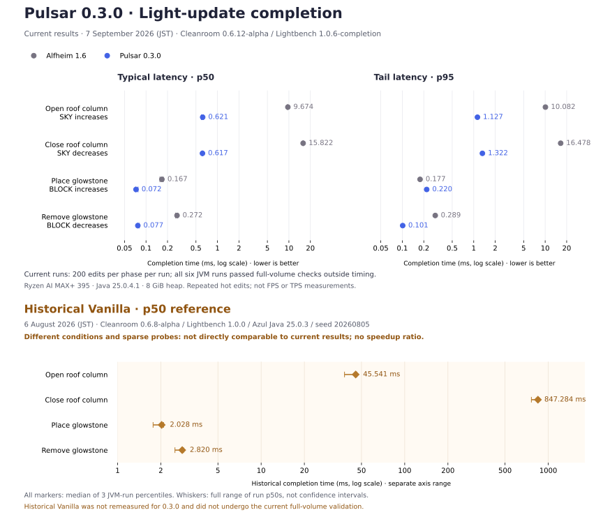

# Pulsar

Pulsar is an async lighting engine for [CleanroomLoader](https://github.com/CleanroomMC/Cleanroom). It reimplements
Starlight-style lighting algorithms for 1.12.2 and moves most server-side
block-light and sky-light propagation off the main server thread.

Unlike vanilla and Alfheim, Pulsar performs most propagation work on dedicated
worker threads. Its goal is to provide an actively developed Cleanroom-native
alternative to lighting engines such as Alfheim and Phosphor.

## Requirements

- [Cleanroom 0.6.10-alpha or newer](https://github.com/CleanroomMC/Cleanroom/releases/tag/0.6.10-alpha)

## Features

Pulsar is designed to reduce server-thread stalls when lighting has a large
amount of work to resolve, such as during chunk generation, explosions,
large building-tool operations, or machine-driven block changes.

- Runs server-side block-light and sky-light propagation on dedicated worker
  threads.
- Batches large groups of block changes instead of lighting every edit
  separately.
- Stores completed Pulsar light data in each chunk's NBT, avoiding unnecessary
  full relights when valid cached chunks are loaded again.
- Keeps Minecraft's standard block-light and sky-light data synchronized, so
  the additional Pulsar cache can be discarded safely if Pulsar is removed.
- Fixes vanilla propagation and rendering problems involving stairs, slabs,
  liquids, emissive blocks, paintings, empty sections, and chunk borders.

The largest gains appear under heavy lighting load. At lighter loads, Pulsar's
main benefit is lower light-update latency rather than higher TPS.

## Fixed Vanilla Issues

Pulsar includes fixes for the following vanilla lighting and rendering issues:

- [MC-92](https://bugs.mojang.com/browse/MC-92)
- [MC-1531](https://bugs.mojang.com/browse/MC-1531) — smooth lighting across
  painting tile boundaries. Only paintings are covered; item frames are not.
- [MC-3329](https://bugs.mojang.com/browse/MC-3329)
- [MC-80966](https://bugs.mojang.com/browse/MC-80966)
- [MC-104532](https://bugs.mojang.com/browse/MC-104532)
- [MC-116690](https://bugs.mojang.com/browse/MC-116690)
- [MC-117067](https://bugs.mojang.com/browse/MC-117067)
- [MC-117094](https://bugs.mojang.com/browse/MC-117094)
- [MC-249343](https://bugs.mojang.com/browse/MC-249343)

## Compatibility

Pulsar should work with most biome, cave, world-generation, and dimension mods
that use Minecraft's standard chunk and world APIs. Please report combinations
that do not work as expected.

### Supported integrations

- [Celeritas](https://git.taumc.org/embeddedt/celeritas), including face-aware
  lighting for stairs and slabs.
- [Fluidlogged API](https://modrinth.com/mod/fluidlogged-api), including the
  opacity and emission of fluids stored inside fluidlogged blocks.
- [Depths Update](https://modrinth.com/mod/depths-update), including dimensions
  that extend below Y=0 or above Y=255.
- [JSON Paintings](https://www.curseforge.com/minecraft/mc-mods/json-paintings),

### Thaumcraft crystal lighting (experimental)

Placed Thaumcraft 6 vis crystal clusters can illuminate nearby blocks using
normal, uncolored block light. All seven crystal types use a minimum light
level of **10** by default (a torch emits 14). This changes actual world
lighting, including light checks used for mob spawning; it is not only a
rendering effect.

In `config/pulsar.cfg`, set `features.thaumcraftCrystalLightLevel` to a value
from 1 to 15, or **0** to preserve Thaumcraft's original emission. Higher
emission supplied by another mod is preserved. Restart the game/server after
changing this setting. Existing chunks are relit as they load when the
setting changes. Use matching settings on the server and clients.

This integration targets placed crystal clusters in Thaumcraft 6; it does
not add handheld dynamic lights or RGB lighting. Thaumcraft is optional.

### Incompatible

- [Alfheim](https://www.curseforge.com/minecraft/mc-mods/alfheim-lighting-engine)
- Phosphor for Forge
- Hesperus
- Any other mod that replaces or rewrites the lighting engine
- The standard edition of The Aether II, which bundles Phosphor. Use
  [The Aether II: Phosphor Not Included](https://www.curseforge.com/minecraft/mc-mods/the-aether-ii-phosphor-not-included)
  instead.

### Unsupported or untested

- CubicChunks is unsupported because it uses a different world-storage model.
- OptiFine is untested and is not currently recommended with Pulsar.

## Performance

### Light updates — Pulsar 0.3.0

The September 7, 2026 benchmark measures the time from a block edit until its
server-side lighting has completed. Each measured edit passed full-volume
light checks outside the timed interval. Each engine was measured across
three separate Minecraft/JVM launches; all six runs passed strict comparison.

Each value below is the median of three run p50s. Times are milliseconds;
lower is better. Ratios use the unrounded values.

| Edit | Alfheim 1.6 | Pulsar 0.3.0 | Alfheim / Pulsar |
|---|---:|---:|---:|
| Open roof column (SKY increases) | 9.674 | 0.621 | 15.58x |
| Close roof column (SKY decreases) | 15.822 | 0.617 | 25.66x |
| Place glowstone (BLOCK increases) | 0.167 | 0.072 | 2.31x |
| Remove glowstone (BLOCK decreases) | 0.272 | 0.077 | 3.54x |

Pulsar had lower median latency in all four workloads, but glowstone placement
had a higher p95: **0.220 ms for Pulsar versus 0.177 ms for Alfheim**. The graph
shows p50 and the full range of run p50s; p95/p99 remain in the detailed data. These are hot,
repeated edits at one position, not FPS, TPS, overall gameplay speed, or a
measurement of a single algorithm's contribution.

#### Historical Vanilla reference — previous measurement

The previous Vanilla results are retained below as historical reference.
The graph marks them as `Vanilla*`, with a note explaining the different conditions.
They used **Lightbench 1.0.0, sparse light probes, Cleanroom 0.6.8-alpha,
Azul Java 25.0.3, and seed `20260805`**. They were not remeasured for 0.3.0
and did not undergo the current full-volume validation. Because the protocol
and environment differ, these values must not be used to calculate speedup
against the current Pulsar or Alfheim results.

| Edit | Historical Vanilla p50, ms | Range of three run p50s, ms |
|---|---:|---:|
| Open roof column (SKY increases) | 45.541 | 38.084–46.356 |
| Close roof column (SKY decreases) | 847.284 | 762.866–848.995 |
| Place glowstone (BLOCK increases) | 2.028 | 1.768–2.092 |
| Remove glowstone (BLOCK decreases) | 2.820 | 2.510–2.880 |

Recorded August 6, 2026 (JST); each value is the median of three run p50s.
[Original update CSV](docs/benchmarks/2026-08-06-light-updates.csv).

Measurement setup and validation limits

- Minecraft 1.12.2 / Cleanroom 0.6.12-alpha, integrated server, Windows 11.
- AMD Ryzen AI MAX+ 395, 32 logical processors, Eclipse Adoptium Java
  25.0.4.1, 8 GiB heap, G1, compact object headers enabled.
- Lightbench 1.0.6-completion, a local validation build with raw JAR hashes.
- Same common mods and frozen configuration in both engines, including
  Red Core 0.7.1. Render distance 2, 60 FPS limit, VSync off.
- Fresh copy of the same seed-1 Superflat template per launch, floor Y=3,
  64×64 stone roof at Y=254. Sky edits open/close one roof column; glowstone
  edits occur at Y=4.
- 20 warmup pairs per workload, then 200 samples per phase. Prespecified
  launch order: Alfheim, Pulsar, Pulsar, Alfheim, Alfheim, Pulsar.
- Full-volume checks after every measured edit: 31×31×252 cells for SKY,
  31×31×17 cells for BLOCK and unchanged SKY. These checks warm the data.
- End-to-end completion includes deferred lighting work. Validation scans,
  raw JSON writing, and separate CPU replays are outside latency samples.

Vanilla was also attempted but failed the stronger volume checks, including
after correcting the harness to drain Vanilla's deferred sky-gap maintenance.
There is no validated new Vanilla update score or Vanilla/Pulsar ratio.
The remaining discrepancy needs investigation; failure alone does not identify
its cause. The historical August sparse-probe values above are separate
reference data, not a validated current baseline.

Three independent launches per engine provide a descriptive comparison, not a
confidence interval or a guarantee for other machines, worlds, or modpacks.
This setup differs from the old benchmark, so it does not measure the speedup
from an older Pulsar release to 0.3.0.

[Full method, raw JSON, run ranges, p95/p99, source snapshot, and failure records](docs/benchmarks/2026-09-07-pulsar-0.3.0/README.md)
· [Run-level CSV](docs/benchmarks/2026-09-07-pulsar-0.3.0/runs.csv)
· [PNG version](docs/benchmarks/2026-09-07-pulsar-0.3.0/light-updates.png)

### Chunk generation

No new generation-speed ranking is published for 0.3.0. Fresh-world pilots
completed with Vanilla, Alfheim, and Pulsar, but strict comparison found
different terrain and light hashes across the 10,404 core chunks. Matching
generation output must be established before comparing these times. The old
generation chart has therefore been retired from this section.

For historical reference only, the previous Vanilla generation measurement
was **56.461 s** for 10,404 chunks (three-run range **55.639–58.628 s**).
This used the older Lightbench 1.0.0 protocol and does not meet the current
terrain/light parity gate; no comparison with the new generation pilots is
made. [Original generation CSV](docs/benchmarks/2026-08-05-lightbench.csv).

[Generation parity results and diagnostic data](docs/benchmarks/2026-09-07-pulsar-0.3.0/README.md#why-there-is-no-new-chunk-generation-ranking)

## Credits

- [Starlight](https://github.com/PaperMC/Starlight) by Spottedleaf, for the
  architecture and core algorithms on which Pulsar is based

- [SuperNova](https://github.com/GTNewHorizons/SuperNova) by GTNewHorizons, a
  Minecraft 1.7.10 port of Starlight that served as the basis for early
  versions of Pulsar

- [Alfheim](https://github.com/Red-Studio-Ragnarok/Alfheim) by Red Studio, as a
  reference for directional neighbour brightness, liquid and emitter rendering,
  and light-only chunk packet handling

- [CleanroomModTemplate](https://github.com/CleanroomMC/CleanroomModTemplate) by
  CleanroomMC

## AI disclosure

Some code in Pulsar was developed with assistance from generative AI and
reviewed before inclusion. Please report any problems you find.

## License

Pulsar is licensed under the [LGPL-3.0](LICENSE.md).
