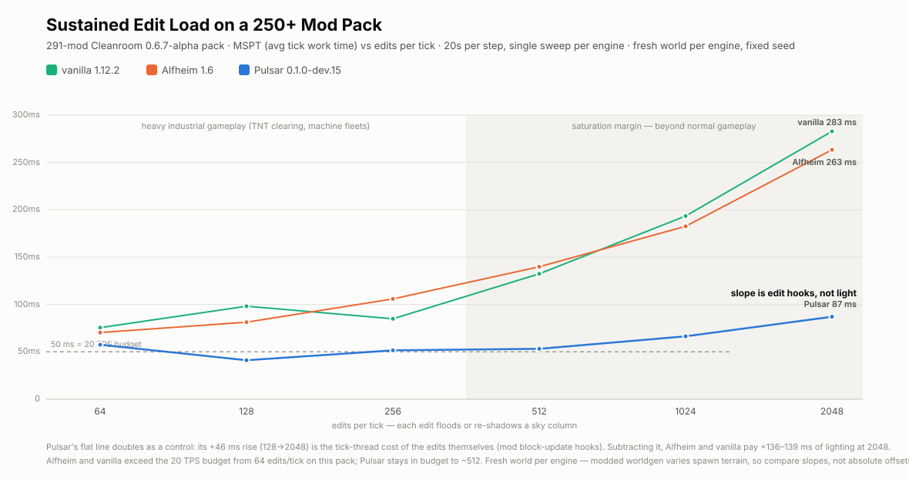

# Pulsar Lighting Engine

Pulsar is an asynchronous lighting engine for Minecraft 1.12.2, built for
[Cleanroom](https://github.com/CleanroomMC/Cleanroom). It replaces
vanilla block and sky lighting with a Starlight-inspired implementation that
moves most light propagation off the server thread.

> [!WARNING]
> Pulsar is experimental. Back up your world before adding it to an existing
> modpack.

## What Pulsar does

Pulsar is designed to reduce server-thread stalls when lighting has a lot of
work to do, such as during chunk generation, explosions, large building-tool
operations, or machines that place and remove many blocks.

- Runs server-side block and sky light propagation on dedicated worker threads.
- Batches large groups of block changes instead of lighting each block
  separately.
- Saves completed light data with each chunk, avoiding a full relight every
  time the chunk loads.
- Writes normal Minecraft light data, so worlds are not locked to Pulsar.
- Fixes several vanilla rendering bugs around slabs, stairs, and light-emitting
  blocks, including [MC-92](https://bugs.mojang.com/browse/MC-92), on
  Minecraft's standard terrain-rendering path.

The largest gains appear under heavy lighting load. At lighter loads, Pulsar's
main benefit is lower light-update latency rather than higher TPS.

## Installation

Pulsar requires:

- [Cleanroom](https://github.com/CleanroomMC/Cleanroom) 0.5.15 or newer

Existing worlds are supported. Their chunks will be relit once so Pulsar can
create its own light cache; make a backup before the first launch.

## Compatibility

Pulsar should work with most biome, cave, world-generation, and dimension mods
that use Minecraft's normal chunk and world APIs. Mods that replace the light
engine are not compatible.

### Supported integrations

- [Fluidlogged API](https://modrinth.com/mod/fluidlogged-api)
- [Depths Update](https://modrinth.com/mod/depths-update), including dimensions
  that extend below Y=0 or above Y=255

### Incompatible or unsupported

- [Alfheim](https://www.curseforge.com/minecraft/mc-mods/alfheim-lighting-engine)
- Phosphor for Forge
- Hesperus
- Any other mod that replaces or rewrites the lighting engine
- The standard edition of The Aether II, which bundles Phosphor; use
  [The Aether II: Phosphor Not Included](https://www.curseforge.com/minecraft/mc-mods/the-aether-ii-phosphor-not-included)
  instead
- CubicChunks, which uses a different world-storage model

OptiFine is untested and not recommended with Pulsar.

## Performance

Pulsar mainly targets server-thread stalls when many blocks change at once. Its
world-generation gains are smaller because terrain generation usually dominates
the overall chunk-generation time. At low edit rates, vanilla, Alfheim, and
Pulsar may all remain within the 50 ms tick budget, but their light-convergence
latency differs: vanilla can take noticeably longer after a demanding
single-block change and falls behind Pulsar much sooner as the edit rate rises.

Benchmark charts, setup, and results

The benchmark uses a Minecraft 1.12.2 port of Spottedleaf's
[lightbench](https://github.com/Sumire-Labs/lightbench) methodology. Each engine
was tested with the same mod list, fixed seed, and a fresh world on
CleanroomLoader 0.5.15. The table contains the mean of two runs, except for the
sustained-load sweep, which was run once per engine.

Test system: Ryzen AI MAX+ 395, Radeon 8060S, BareBones Template Cleanroom
instance.

| Test | Vanilla 1.12.2 | Alfheim 1.6 | Pulsar 0.1.0-dev.14 |
|---|---:|---:|---:|
| Generate and fully light 10,201 chunks | 61.3 s | 54.0 s | **49.8 s** |
| World generation, p99 per chunk | 16.7 ms | 12.3 ms | **11.7 ms** |
| Remove one block, light converged, p50 | 23.5 ms | 4.28 ms | **0.18 ms** |
| Place one block, light converged, p50 | 308 ms | 10.3 ms | **0.18 ms** |
| Relight a 4,096-block platform | 26.0 s | 0.6 s | **0.2 s** |
| MSPT at 256 edits per tick | 32.5 ms | 38.7 ms | **7.3 ms** |
| MSPT at 2,048 edits per tick | 233 ms | 196 ms | **33.6 ms** |

The sustained-load test repeatedly changes sky-blocking blocks at rates far
above normal gameplay. It measures how each engine behaves when its light queue
is continuously busy; it is not a prediction of everyday FPS or TPS.

The same stress test was also run in a roughly 290-mod pack. Terrain generation
varied too much for a useful direct comparison, but Pulsar continued to keep
the server thread below the 50 ms tick budget at substantially higher edit
rates.

## Trade-offs

Pulsar moves work away from the server thread, but that comes with costs:

- Server-side light updates are asynchronous. Code that changes a block and
  immediately reads its light in the same call stack may briefly see the
  previous value.
- Pulsar keeps additional light data for loaded chunks and stores a light cache
  in the world save, increasing memory and disk usage.
- Heavy lighting workloads can use additional CPU cores. Performance on
  CPU-constrained systems has not yet been benchmarked.
- Pulsar is newer and has seen less modpack testing than
  [Alfheim](https://www.curseforge.com/minecraft/mc-mods/alfheim-lighting-engine).

## Troubleshooting

If an area has incorrect light, an operator can queue a relight with:

- `/pulsar relight` for the current chunk
- `/pulsar relight <radius>` for nearby loaded chunks, up to a radius of 16
- `/pulsar relight <chunkX> <chunkZ>` for a specific loaded chunk

`/pulsar stats` reports whether light work is pending. `/pulsarc` prints a
client-side light diagnostic that is useful when filing a bug report.

Please attach `latest.log`, the relevant configuration files, and the output of
`/pulsarc` when reporting a lighting problem.

## Credits

- [Starlight](https://github.com/PaperMC/Starlight) by Spottedleaf, for the
  architecture and core algorithms
- [ScalableLux](https://github.com/RelativityMC/ScalableLux) by RelativityMC,
  for later Starlight fixes and implementation references
- [SuperNova](https://github.com/GTNewHorizons/SuperNova) by GTNewHorizons, the
  1.7.10 Starlight port on which early Pulsar versions were based
- [Alfheim](https://github.com/Red-Studio-Ragnarok/Alfheim) by Red Studio, for
  the MC-92 family of rendering fixes
- [CleanroomModTemplate](https://github.com/CleanroomMC/CleanroomModTemplate) by
  CleanroomMC

## AI disclosure

Some code in Pulsar was developed with assistance from generative AI and
reviewed before inclusion. Please report any problems you find.

## License

Pulsar is licensed under the [LGPL-3.0](LICENSE.md).
