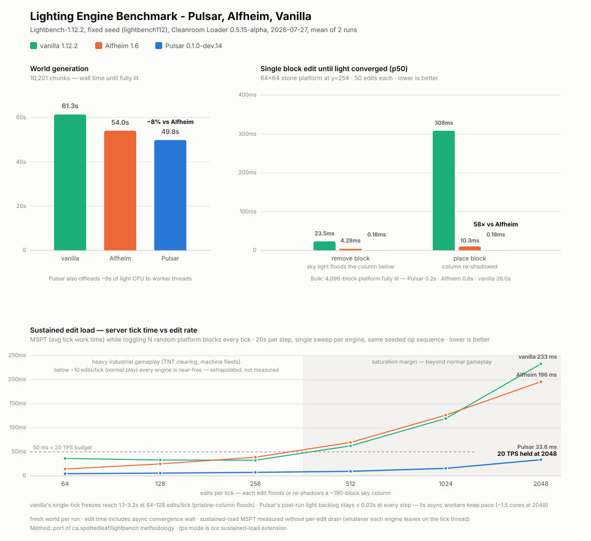

# Pulsar

A Starlight-style scalar lighting engine for Minecraft 1.12.2, built for [CleanroomLoader](https://github.com/CleanroomMC/CleanroomLoader).

> [!WARNING]
> This mod is a personal hobby project and still in an early stage of development (`0.1.0-dev.x`).
> It has been benchmarked and play-tested, but not battle-tested across large modpacks — keep backups of your worlds.
> If you want something safe and proven today, use [Alfheim](https://www.curseforge.com/minecraft/mc-mods/alfheim-lighting-engine) instead.

## Overview

Pulsar fully replaces the vanilla lighting engine with an implementation of [Starlight](https://github.com/PaperMC/Starlight)'s architecture: SWMR (single-writer multi-reader) nibble arrays, per-chunk initial lighting with deferred edge checks, and BFS propagation that runs on dedicated worker threads instead of the server thread.

### Lineage

Pulsar started as a rewritten port of the scalar core of [SuperNova](https://github.com/GTNewHorizons/SuperNova), GTNewHorizons' Starlight-based RGB lighting engine for 1.7.10. Since then the engine has been progressively realigned with **upstream Starlight itself** — restoring upstream BFS optimizations and upstream-style batched block-change processing — and extended with 1.12.2-specific work that has no SuperNova counterpart (light persistence, a thin client pipeline, chunk-send gating). Today the architecture follows PaperMC/Starlight directly; SuperNova remains the historical starting point and is credited below.

### What it does

- Replaces vanilla block **and** sky light propagation with Starlight-equivalent BFS.
- Runs light computation on worker threads — the server thread never pays for lighting.
- Processes bulk edits (explosions, `/fill`, worldedit-style paste) as one batch per chunk instead of per block.
- Caches light in chunk NBT (`PulsarLight` tag): worlds do not relight on every load. The cache is version-gated, so light from older/incompatible builds is relit automatically.
- Keeps the vanilla `blockLight`/`skyLight` nibbles in sync, so removing the mod leaves a working world behind.
- Thin client: the server's light is authoritative and the client never recomputes it. Chunks are sent only once their own and their four neighbours' initial light is done (no light-update packet exists in 1.12.2, so light sent wrong would stay wrong).
- Fixes vanilla rendering bugs around directional light ([MC-92](https://bugs.mojang.com/browse/MC-92) family — slabs and stairs, ported from Alfheim under MIT) and light-emitting blocks darkened by ambient occlusion (MC-50734, MC-249343).

### What it doesn't do

- No RGB / colored light — Pulsar is scalar only, visual output is identical to vanilla. (If you want RGB on 1.7.10, that's literally SuperNova.)

## Benchmarks

Measured with a 1.12.2 port of Spottedleaf's [lightbench](https://github.com/Sumire-Labs/lightbench) methodology on CleanroomLoader 0.5.15-alpha, fixed seed, fresh world per run, identical mod stack with only the lighting engine swapped. Values are the mean of 2 runs.

| | vanilla 1.12.2 | Alfheim 1.6 | Pulsar |
|---|---:|---:|---:|
| Worldgen, 10,201 chunks until fully lit | 61.3 s | 54.0 s | **49.8 s** |
| — p99 per chunk | 16.7 ms | 12.3 ms | **11.7 ms** |
| Block **remove** until light converged (p50) | 23.5 ms | 4.28 ms | **0.18 ms** |
| Block **place** until light converged (p50) | 308 ms | 10.3 ms | **0.18 ms** |
| Bulk: 4,096-block platform fully lit | 26.0 s | 0.6 s | **0.2 s** |

Worldgen wall time is dominated by terrain generation itself, so the honest headline there is modest (−19% vs vanilla, −8% vs Alfheim, plus ~9 s of light CPU moved off the main thread). The algorithmic difference shows on the **edit-latency axis**: single-block light convergence is 24–58× faster than Alfheim and vanilla's worst spikes (p99/max) disappear — which is what you feel as stutter in game.

## Requirements

- [CleanroomLoader](https://github.com/CleanroomMC/CleanroomLoader) >= 0.5.x (benchmarked on 0.5.15-alpha)

Install by dropping the jar into `mods/`. No other mod is required.

## Compatibility

Pulsar fully replaces the vanilla lighting engine, so it conflicts with anything that does the same.

### Incompatible

- **[Alfheim](https://www.curseforge.com/minecraft/mc-mods/alfheim-lighting-engine)** — lighting engine replacement.
- **Phosphor (Forge)** and **Hesperus** — lighting engine replacements.
- **Any other mod that replaces or rewrites the lighting engine.**
- **The Aether II** — bundles Phosphor. Use [The Aether II: Phosphor Not Included](https://www.curseforge.com/minecraft/mc-mods/the-aether-ii-phosphor-not-included) instead.
- **CubicChunks** — cubic world format, untested and likely incompatible.

### Not recommended

- **OptiFine** — untested, most likely incompatible. Use [Celeritas](https://github.com/kappa-maintainer/Celeritas-auto-build) instead (see below).

### Works with

- **[Celeritas](https://github.com/kappa-maintainer/Celeritas-auto-build)** — Pulsar ships dedicated integration: its `WorldSlice` render path is routed through Pulsar's directional-light fixes, and Pulsar invalidates Celeritas's cloned-section cache when light changes so chunk meshes never rebuild from stale light. Both hooks are soft dependencies that disable themselves cleanly when Celeritas is absent.
- Developed and benchmarked alongside the usual Cleanroom performance stack (StellarCore, VintageFix, LoliASM and friends) with no known conflicts.

## Known issues

- Building a platform in open air **above** the previously highest block of a chunk can leave the space under it rendered bright until the area is relit — tracked in the [Changelog](Changelog.md) under `0.1.0-dev.14` Known issues.

## Credits

- [Starlight](https://github.com/PaperMC/Starlight) by Spottedleaf — the architecture and core algorithms Pulsar implements.
- [SuperNova](https://github.com/GTNewHorizons/SuperNova) by mitchej123 / GTNewHorizons — the 1.7.10 Starlight port Pulsar originally grew out of.
- [Alfheim](https://github.com/Red-Studio-Ragnarok/Alfheim) by Red Studio — the directional render-light fixes (MC-92 family) are ported from Alfheim under MIT.
- [CleanroomModTemplate](https://github.com/CleanroomMC/CleanroomModTemplate) by CleanroomMC — the modding template Pulsar is built on.

## License

[LGPL-3.0](LICENSE.md). The render-light fixes ported from Alfheim remain under their original MIT license.

## ⚠️ Notice

Part of this mod's code is written with the help of generative AI. I review the generated code beforehand, but on rare occasions an imperfection may still remain — if you spot one, I'd appreciate it if you let me know via an Issue.

I'm also well aware that some people feel uneasy about, or dislike, software that uses generative AI. If you're okay with that, I'd be glad to have you use this mod.
